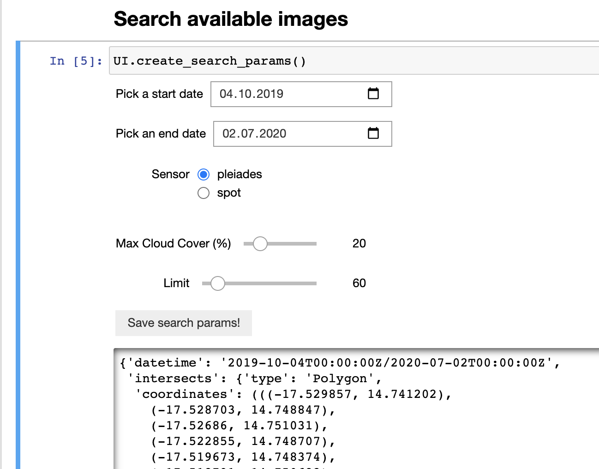
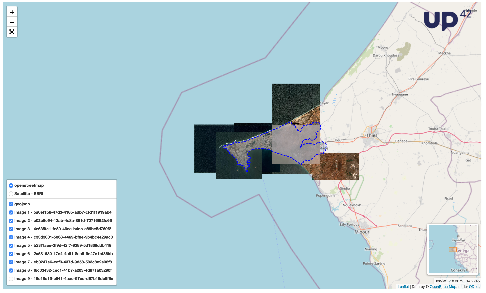
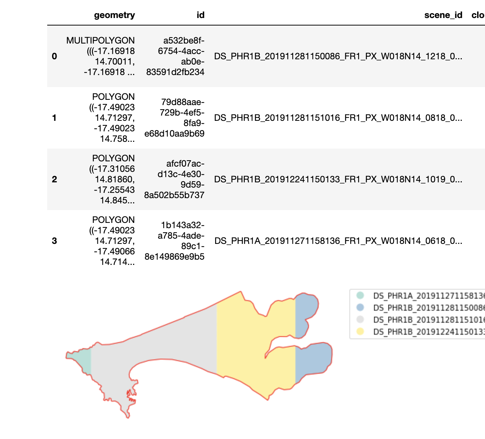

# Mosaicking  [](https://mybinder.org/v2/gh/up42/mosaicking/master?filepath=mosaicking.ipynb)

## Highlights
- Jupyter notebook to create mosaics using Pleaides/SPOT imagery
- Easy to use with interactive widgets!
- Optimise coverage and save on UP42 credits
- Built on top of [UP42's Python SDK](https://github.com/up42/up42-py)

Visual interface for search parameters         |  View all quicklooks | View the result of optimization
:-------------------------:|:-------------------------:|:-------------------------:
  |   |  |

Try mosaicking without any installation! [](https://mybinder.org/v2/gh/up42/mosaicking/master?filepath=mosaicking.ipynb)

## Installation

Install `spatialindex` via brew before installing the python requirements.

```bash
# MacOS
brew install spatialindex
# Ubuntu
sudo apt-get install -y libspatialindex-dev
# Windows
pip install http://www.lfd.uci.edu/~gohlke/pythonlibs/djcobkfp/Rtree-0.8.2-cp27-cp27m-win_amd64.whl
```

Create a virtual environment:
```bash
mkvirtualenv --python=$(which python3.7) up42-mosaicking
```

Activate the virtual environment:
```bash
workon up42-mosaicking
```

Install python requirements in the virtual environment:
```bash
(up42-mosaicking) pip install -r requirements.txt
```

Register Jupyter kernel to make sure virtual environment is used:

```bash
(up42-mosaicking) python -m ipykernel install --user --name=up42-mosaicking
```

Select kernel on the top right of the Jupyter notebook.

To be able to use the widgets with Jupyter Lab, please follow the official [instructions](https://ipywidgets.readthedocs.io/en/latest/user_install.html#installing-the-jupyterlab-extension) to install the Jupyter Lab Extension.

## Usage

Open the [notebook - mosaicking.ipynb](mosaicking.ipynb) in Jupyter:
```bash
jupyter notebook
```
Then click on **Run all cells** button to display all the widgets in the notebook. After this step **ONLY use the buttons to interact with the notebook**.

### Authentication

To use the mosaicking Jupyter notebook you need an UP42 account - sign up [here](https://console.up42.com/)! Copy your Project ID and Project API Key from the Developer tab in your project page.

### Setup

After you authenticate you can select an output folder and an input geometry file.

### Search for imagery

With the given geometry, you can use our catalog to search for suitable Pleaides or SPOT imagery given your constraints (time span and cloud cover). By default a maximum of 10 scenes will be returned - if you're searching in a very large area please adapt the limit accordingly.

You will also be able to display quicklooks of the returned imagery.

### Optimise coverage

In this step you'll be able to optimise the coverage of your AOI by adapting parameters such as maximum incidence angle, minimum section area and define the overlap between different images. The minimum section area is the minimum size that one specific image contributes to the mosaic - note that for placing an order with the Pleiades/SPOT Download blocks, the minimum area is 0.1 sqkm. Make sure after this step to inspect the output files and coverage carefully!

### Create workflow and run test jobs

With the previous optimised coverage you can now place test jobs on UP42 to make sure all the required scenes are available and what is the expected cost in credits to generate this mosaic.

### Run jobs

Before running the jobs, make sure that the coverage is sufficient and the imagery quality is as expected. This step will charge credits on your account while ordering the imagery. You can access the ordered imagery after running this step at all times in the [UP42 console](https://console.up42.com/).

### Mosaic imagery

After ordering the imagery, you can now proceed with stitching the imagery together. Then final mosaic output will be saved in the output directory you selected previously as `mosaic.tif`.


## Support

For any kind of issues or suggestions please contact us via Email **[support@up42.com](mailto:support@up42.com)** or open a **[github issue](https://github.com/up42/mosaicking/issues)**.
